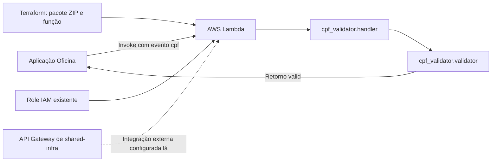

# Validador de CPF da Oficina

Este repositório implementa e provisiona a função AWS Lambda `CpfValidatorTest`, usada pela aplicação Oficina para validar CPFs. O código recebe um evento com a chave `cpf` e retorna `{"valid": true}` ou `{"valid": false}`. A função e a regra de validação ficam aqui; o API Gateway que a referencia pertence ao `shared-infra`.

## Tecnologias utilizadas

Python 3.12, AWS Lambda, Terraform (providers AWS e Archive), Poetry, Pytest, Black, isort e GitHub Actions. O Dockerfile também permite montar uma imagem de execução local da Lambda; o deploy configurado no Terraform usa um pacote ZIP gerado a partir de `src/`.

## Arquitetura deste repositório



A role IAM e o API Gateway são recursos externos; este Terraform cria a função a partir do código Python.

## Execução local

Requer Python 3.12 e Poetry. Instale as dependências e execute os testes:

```bash
poetry install
poetry run pytest
poetry run black --check .
poetry run isort --check-only .
```

Para testar o contrato do handler diretamente:

```bash
poetry run python -c 'from cpf_validator.handler import handler; print(handler({"cpf": "52998224725"}, None))'
```

## Deploy na AWS

Requer Terraform 1.0+, AWS CLI autenticada, permissões para Lambda e uma role de execução existente com confiança para `lambda.amazonaws.com`. Ajuste `lambda_execution_role_arn`, `lambda_function_name` e `aws_region` em `terraform/variables.tf` ou passe valores com `-var` para a conta de destino. O valor padrão da role aponta para o sandbox AWS Academy; confirme que ela existe na conta escolhida.

```bash
terraform -chdir=terraform init
terraform -chdir=terraform fmt -check
terraform -chdir=terraform validate
terraform -chdir=terraform plan -var='lambda_execution_role_arn=arn:aws:iam::SEU_ACCOUNT:role/SUA_ROLE'
terraform -chdir=terraform apply -var='lambda_execution_role_arn=arn:aws:iam::SEU_ACCOUNT:role/SUA_ROLE'
terraform -chdir=terraform output lambda_function_arn
```

O Terraform empacota `src/` em `lambda.zip` e publica a função. Em pushes para `main`, o GitHub Actions executa testes e lint, depois plan e apply. Configure `AWS_ACCESS_KEY_ID`, `AWS_SECRET_ACCESS_KEY` e, se a sessão usar credenciais temporárias, `AWS_SESSION_TOKEN` nos Secrets do repositório. A pipeline usa os valores padrão das variáveis Terraform; para outra conta, atualize ou sobrescreva a role antes do deploy. O state atual é local; compartilhe um backend remoto antes de alternar o gerenciamento da mesma função entre máquina local e runner.

## Documentação das APIs

O handler é invocado com um evento Python `{"cpf": "52998224725"}` e não fornece Swagger ou Postman próprios. A API HTTP da Oficina tem [Swagger UI](https://github.com/douradorobert-pos-fiap-project/tech-challenge-fiap#documentação-da-api); as integrações do Gateway, incluindo a Lambda, estão descritas em [rotas e integrações](https://github.com/douradorobert-pos-fiap-project/shared-infra/blob/main/docs/api-gateway-routes.md). A integração `AWS_PROXY` do API Gateway entrega um evento HTTP diferente do evento simples esperado pelo handler, portanto não trate a rota `/cpf` como contrato público validado sem adaptar e testar essa integração.
